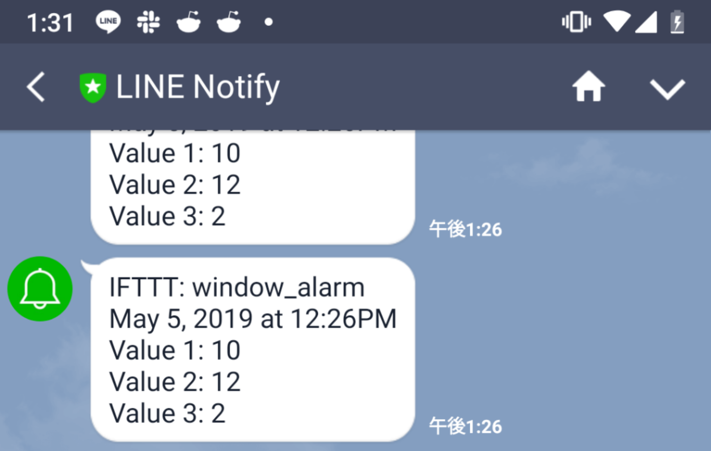

# Window Alarm

Sound an alarm and notify LINE using M5stack when Window is opend.
9-axis sensor is used to detect window open.

<video width="540" height="960" controls>
  <source src="window_alarm.mp4" type="video/mp4">
</video>

Reference:
https://github.com/m5stack/M5Stack/blob/master/examples/Modules/MPU9250/MPU9250BasicAHRS/MPU9250BasicAHRS.ino
https://thousandiy.wordpress.com/2017/10/17/esp32_ifttt_line/
https://qiita.com/KatsuShun89/items/df91a16ed5d58710b858

